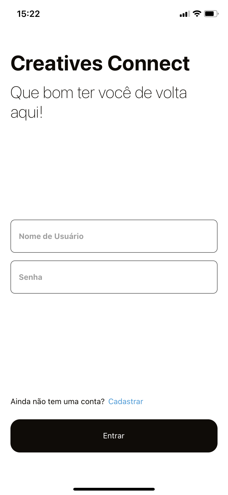
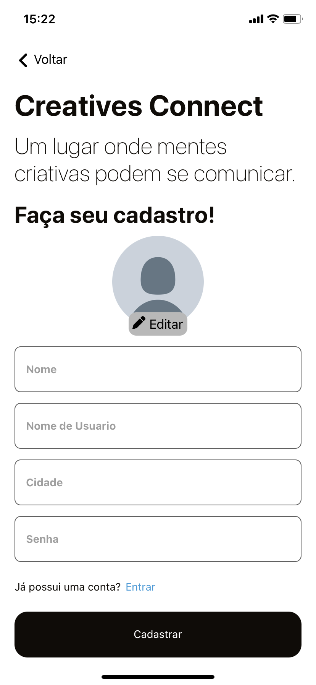
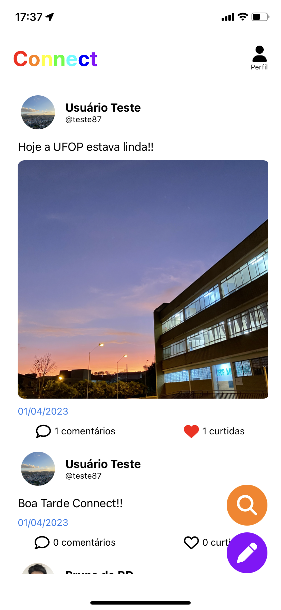
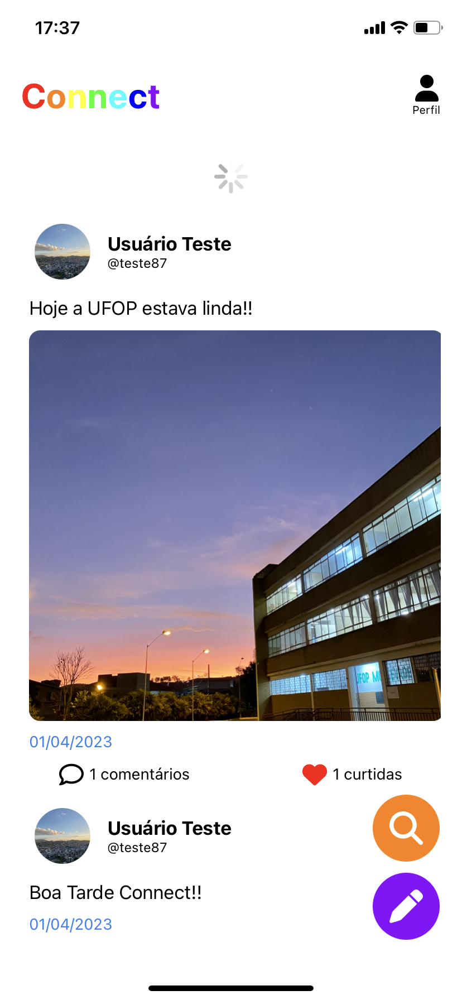
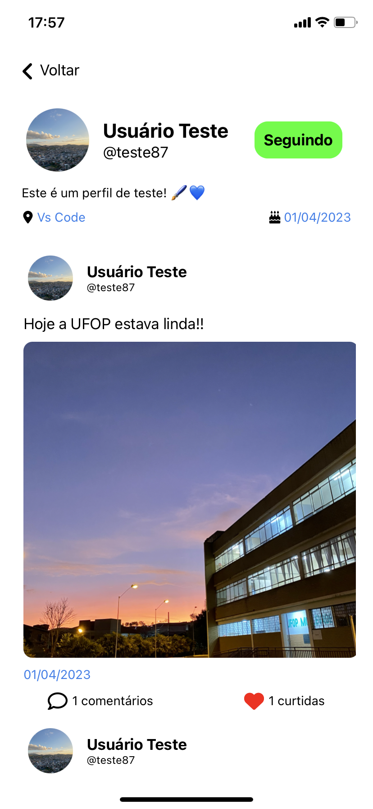
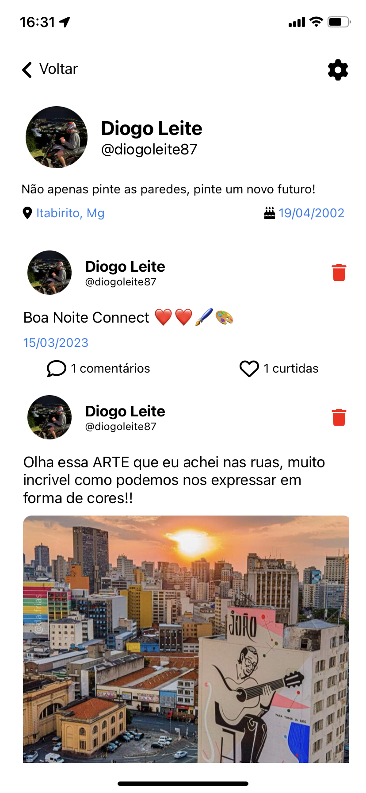
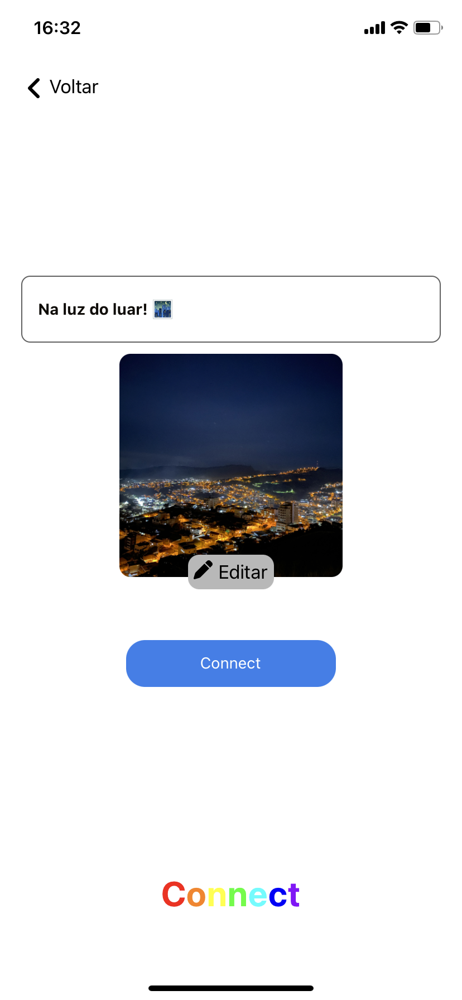
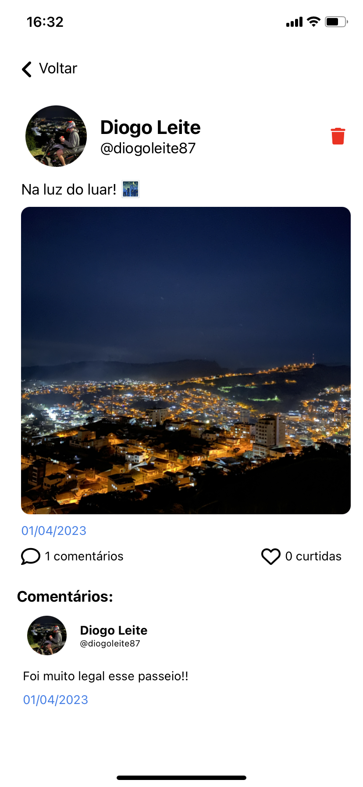
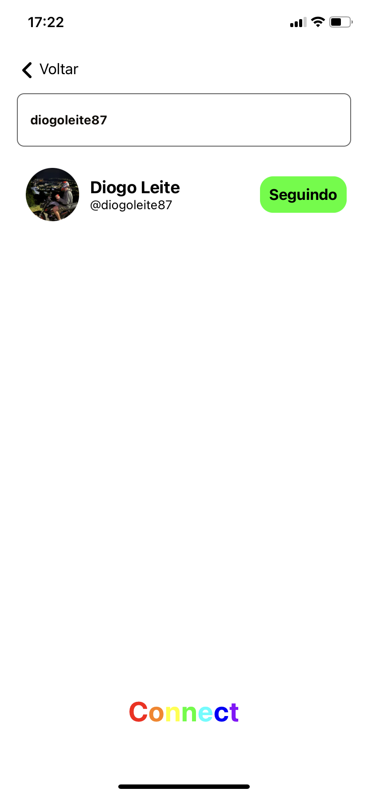
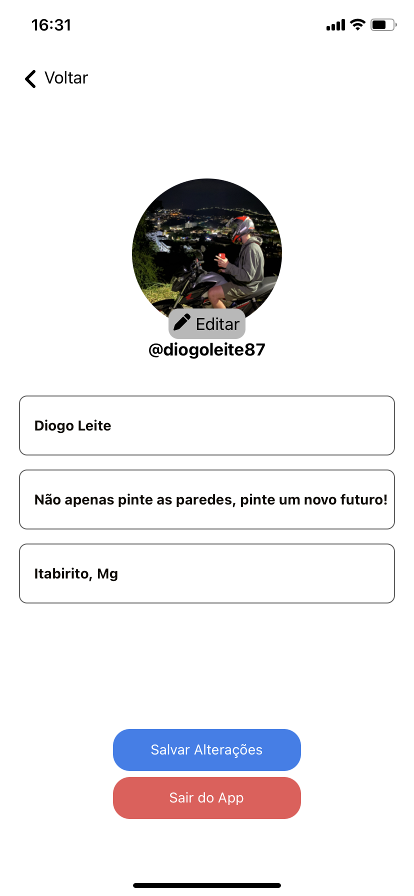

# Creatives Connect

## Trabalho desenvolvido durante a disciplina Banco de Dados 2 - UFOP. Backend da aplicação desenvoldido por meu companheiro de equipe <a href="https://github.com/Filipey" target="_blank">Filipe Moura</a>, repositório da aplicação backend disponivel <a href="https://github.com/Filipey/Creatives-Connect-API" target="_blank">aqui</a>. Creatives Connect é uma rede social criada para conectar mentes criativas de diversas áreas, permitindo que os usuários possam compartilhar suas ideias, fotos e comentários.

## Primeiramente, vamos discutir como executar 🏃‍

```bash

# Antes de tudo, acesse o repositorio backend do Filipe Moura e siga as instruções para instalar o backend da aplicação

-> Acesse: https://github.com/Filipey/Creatives-Connect-API

# Feito isso, clone este repositório
$ git clone https://github.com/diogoleite87/creatives-connect-mobile-client

# Acessa a pasta do frontend no terminal
$ cd creatives-connect-mobile-client

# Instale as dependências
$ yarn

# Execute a aplicação
$ yarn dev

# A aplicação iniciará na porta que estiver disponível em sua máquina
# Execute o backend seguindo o tutorial disponível no repositório do Filipe Moura

```

# Apresentação (Algumas Funcionalidades)

## Tela Login e Registro

### Nessa tela, voce pode entrar com uma conta cadastrada, ou cadastrar uma nova conta, podendo adicionar imagem de perfil, nome, username e etc.

<div style="display: flex; gap: 10px; justify-content: center;">
  
  
</div>

## Tela de Início (TimeLine)

### Nessa tela, ao efetuar o login, você se depara com sua timeline, onde aparecem connects dos usuário em que você segue.

<div style="display: flex; gap: 10px; justify-content: center;">
  
  
</div>

## Perfil

### Nessa tela, você pode exibir o perfil de algum usuário ou seu proprio perfil.

<div style="display: flex; gap: 10px; justify-content: center;">
  
  
</div>

## Connects (Postagem)

### Nessa tela, você pode postar alguma mensagem, bem como a mensagem acompanhada de uma imagem, se preferir. Além de poder comentar os seus connects e/ou connects de outros usuários.

<div style="display: flex; gap: 10px; justify-content: center;">
  
  
</div>

## Editar Perfil e Buscar Perfil

### Nessa tela, você pode pesquisar por um usuário e alem de poder também editar as informações do seu usuário.

<div style="display: flex; gap: 10px; justify-content: center;">
  
  
</div>
